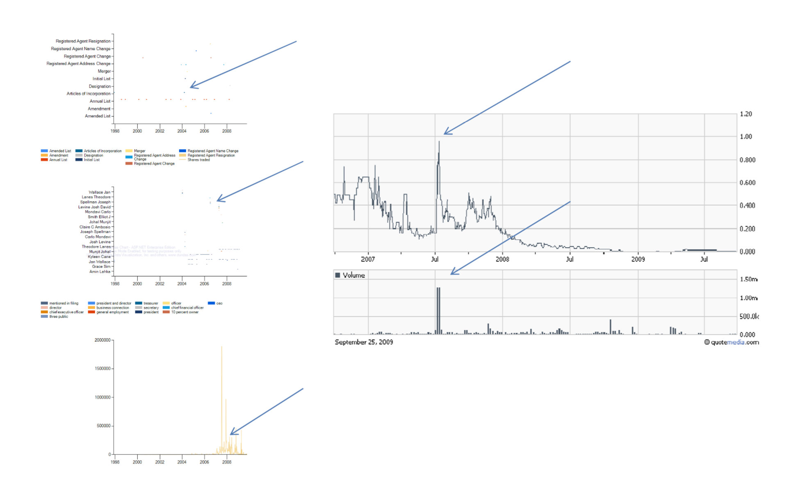
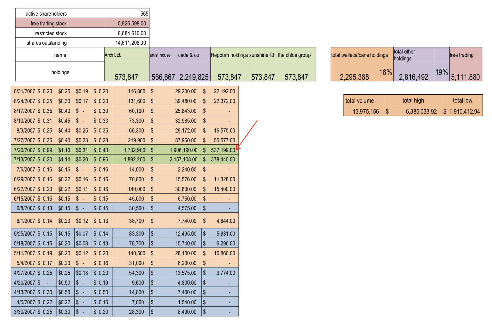

### SEC Parser

This was used to catch an attorney launder money.

This software created timeline and support information which evidenced individuals involved in schemes to launder money through pumping and dumping of unregistered securities.  To read the legal consequences [see SEC Case and SDNY Case 14-00399](Offshore_Accounts.pdf).

## Workflow

The user must provide the target companies to the system. Then the system will process SEC regulatory files from their servers and digtest them. _This takes both time and storage_ Once the public filings have been processed. The user is presented with names and entities and charts of flagged activities. This is an example.

The left top diagram lists the individuals involved. The left middle diagram highlights activiites flagged by the system. The bottom left diagram is the stock volume and price. The diagrams attempt to make transparent a number of activites before, during, and after the pump and dump activity. The diagram on the right computes the total value of the activity.

The above scheme was further analyzed using actual stock ledgers and price breakdowns. [This](Offshore_Accounts.pdf) document contains the stock ledger, the off-shore Cayman Island invoices, and an overview of the operations of the brokerage house [LOM Securities]((https://www.lom.com/). The spreadsheet validates the software output.

Entties are extracted from the SEC filings and tracked when they are active or inactive in the company. Additionally, the timelines track the _underlying_ company, or the entities prior to the shell company. 

## Method

A publicly traded company can create a subsidary with n shares. The subsidary can be spun out and left dormant. The bad actors then place the stock certificates into off-shore companies, for example [LOM Securities](https://www.lom.com/).

The dormant company shares are split across a number of _shell companies_, careful to not exceed __4%__ of the outstanding stock.

During this phase the lawyer and company operator conduct a series of reverse splits on the stock. The bad actors and lawyer then sell the shell to a company in what is called "reverse merger" transaction. During the capitalization of the new company, new investments are made.

The bad actor and lawyer do not disclose the true volume of stock, the off-shore companies, or the fact that they control more than 50% of the outstanding stock. While the new company raise funds, and conducts business, they increase the share price. Doing so, the new company believes they are adding value to their shareholders. 

During this time, the bad actor and lawyer orchestrate the sale of their shares from the off-shore companies.  

Or they partner with a high-net worth indivduaal to purchase large blocks of shares to move funds outside the United States.  In this scenario, the entity making the investment can then later file bankruptcy and the wealthy individual can write off the "losses". In reality, this individual will just visit the Cayman Islands to pick up his money.

## Pattern

By using entity matching within the SEC documents. This code matches individuals and entities they are related to. A model of the company is formed with the number of outstanding shares. Reverse splits and forward splits are tagged. Additional markers are made and a model of the money laundering is provided in the form of a timeline chart.

## Application

This information can be used in a number of ways. 

1. Idenitfy individuals involved in financial schemes
2. Identify companies to short their stock
3. Hedgefunds

## MIT License

